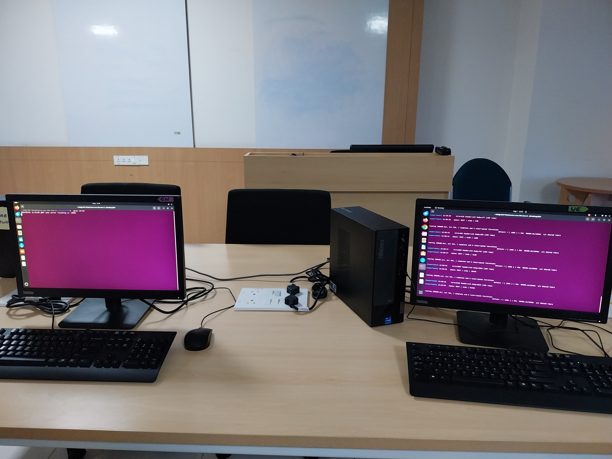
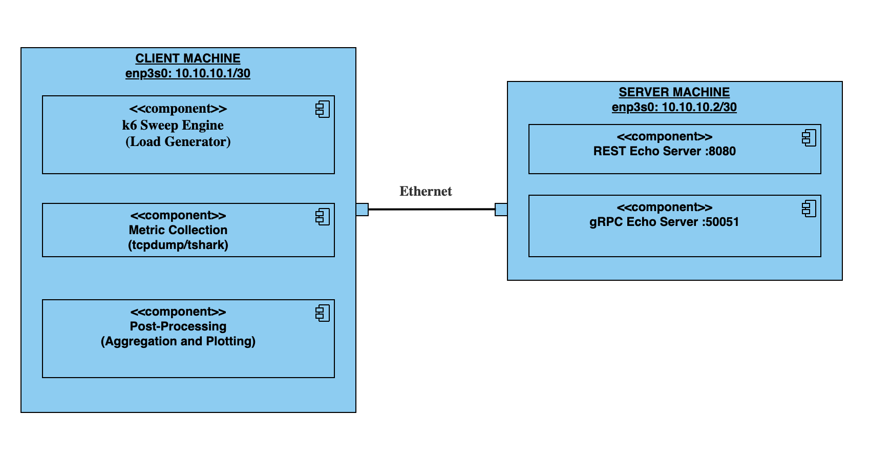

# Measuring Network Overhead in Space and Time — REST vs gRPC



## Table of Contents

- [1. Aim](#1-aim)
- [2. Folder Structure](#2-folder-structure)
- [3. Input Space](#3-input-space)
  - [3.1 Space Experiments](#31-space-experiments-encoding--framing-overhead)
  - [3.2 Time Experiments](#32-time-experiments-serialization-overhead)
- [4. Two-Machine Setup](#4-two-machine-setup)
  - [4.1 Network Topology](#41-network-topology)
  - [4.2 Machine Specifications](#42-machine-specifications)
  - [4.3 Software Versions](#43-software-versions)
- [5. Architecture](#5-architecture)
  - [5.1 Client — k6 Sweep & Metric Collection](#51-client--k6-sweep--metric-collection)
  - [5.2 Server — Minimal Echo Servers](#52-server--minimal-echo-servers)
  - [5.3 Native Encoding per Protocol](#53-native-encoding-per-protocol)
- [6. Measurement Tools](#6-measurement-tools)
- [7. Output Metrics](#7-output-metrics)
- [8. Plots](#8-plots)

---

## 1. Aim

This project studies the **network overheads** introduced by REST (HTTP/1.1 + JSON) and gRPC (HTTP/2 + Protobuf) across two dimensions:

| Dimension | What it captures | Overhead type |
|-----------|-----------------|---------------|
| **Space** | How many extra bytes each protocol puts on the wire beyond the logical application data | **Encoding overhead** (JSON vs Protobuf binary) and **Framing (Header) overhead** (HTTP/1.1 headers vs HTTP/2 HPACK-compressed frames) |
| **Time** | How long each protocol spends converting structured data to/from its wire format | **Serialization / Deserialization overhead** (`JSON.stringify`/`JSON.parse` vs `proto.Marshal`/`proto.Unmarshal`) |

Both protocols transport the **same logical data** — a structured key-value object — but each uses its own native serialization: REST sends JSON over HTTP/1.1, and gRPC sends Protobuf-encoded binary over HTTP/2. This ensures we observe real encoding differences rather than an opaque byte blob.

---

## 2. Folder Structure

```
Network-Overhead/
│
├── go.mod / go.sum                       # Go module (grpc v1.80, protobuf v1.36)
│
├── servers/
│   ├── rest/
│   │   ├── main.go                       # HTTP server on :8080
│   │   └── handler.go                    # POST /echo — JSON echo + X-Server-Ns header
│   └── grpc/
│       ├── main.go                       # gRPC server on :50051
│       ├── handler.go                    # Echo RPC — proto echo + server timing
│       └── proto/
│           ├── echo.proto                # Service + message definitions (repeated Entry)
│           ├── echo.pb.go                # Generated (protoc)
│           └── echo_grpc.pb.go           # Generated (protoc)
│
├── client/
│   ├── payloads/
│   │   ├── generator.js                  # k6-compatible payload generator (flat/nested/wide/array)
│   │   └── schemas/                      # Structure descriptions (flat/nested/wide/array .json)
│   ├── space/
│   │   └── sweep.js                      # k6 space experiment (1 iter, tcpdump captures wire bytes)
│   └── time/
│       └── sweep.js                      # k6 time experiment (1000 iters, CSV output)
│
├── scripts/
│   ├── run_experiment.sh                 # Master orchestrator (space | time | analysis | all)
│   ├── local_test.sh                     # Local testing variant (single-machine)
│   ├── capture_network.sh               # tcpdump start/stop wrapper
│   └── analyse_pcap.sh                  # tshark pcap → wire/header/body CSV
│
├── analysis/
│   ├── aggregate.py                      # Raw CSVs → aggregated O1/O2/O3
│   ├── plot_space.py                     # Encoding overhead + framing overhead plots
│   ├── plot_time.py                      # Ser/deser 2×2 grid + per-structure plots
│   └── plot_bars.py                      # Bar chart variants
│
├── metrics/
│   ├── raw/
│   │   ├── pcaps/                        # tcpdump packet captures
│   │   ├── space/                        # Per-request wire/header/body bytes CSVs
│   │   └── time/                         # Per-iteration server timing CSVs (ns)
│   └── aggregated/
│       ├── overhead_ratio.csv            # O1 — wire_bytes / logical_bytes
│       ├── header_body_ratio.csv         # O2 — wire_bytes / encoded_body_bytes
│       ├── overhead_decomposition.csv    # Breakdown of encoding vs framing contribution
│       └── ser_deser_overhead.csv        # O3 — ser+deser time (ns)
│
├── results_lab/                          # Final PNG plots (two-machine experiment)
├── results_local/                        # Final PNG plots (local testing)
│
├── machine_specs.txt                     # Hardware specs capture script + output
└── versions_used.txt                     # k6, tshark, Go version strings
```

---

## 3. Input Space

### 3.1 Space Experiments (Encoding & Framing Overhead)

The space experiment measures how many bytes land on the wire relative to the logical payload.

```
I_space = Payload × Structure × Protocol

Payload   = { 32B, 64B, 128B, 512B, 1KB, 8KB, 64KB, 512KB }
Structure = { flat, nested, wide, array }
Protocol  = { REST, gRPC }

|I_space|  = 8 × 4 × 2 = 64 configurations
```

| Dimension | Values | Description |
|-----------|--------|-------------|
| **Payload** | 32 B → 512 KB (8 sizes) | Target logical (pre-serialization) data size. The generator iteratively tunes the number/length of key-value pairs to hit each target within ~5%. |
| **Structure** | flat, nested, wide, array | Four structural patterns that exercise different serialization code-paths. |
| **Protocol** | REST, gRPC | REST = JSON body over HTTP/1.1; gRPC = Protobuf binary over HTTP/2. |

**Structure Types:**

| Structure | Shape | Exercises |
|-----------|-------|-----------|
| **Flat** | `{key_0: "val", key_1: "val", ...}` | Baseline — simple string-to-string map |
| **Nested** | `{a: {b: {c: ... }}}` | Deep object nesting; tests recursive serialization |
| **Wide** | `{k0: "v", k1: "v", ..., kN: "v"}` | Many short keys; high key-count-to-value-size ratio |
| **Array** | `{items: ["v0", "v1", ...]}` | Repeated homogeneous elements |

### 3.2 Time Experiments (Serialization Overhead)

The time experiment measures how long serialization and deserialization take, in nanoseconds.

```
I_time = Payload × Structure × Protocol

Payload   = { 32B, 64B, 128B, 512B, 1KB, 8KB, 64KB, 512KB }
Structure = { flat, nested, wide, array }
Protocol  = { REST, gRPC }

|I_time|   = 8 × 4 × 2 = 64 configurations
```

Each configuration runs for **R = 1000 requests** in a single k6 run. The first 10% of samples are discarded as warm-up, and the **mean** is reported per configuration.

**Concurrency is fixed at c = 1** — a single sequential request stream — to isolate serialization cost from queueing and scheduling effects.

---

## 4. Two-Machine Setup

### 4.1 Network Topology

```
┌─────────────────────────┐    Gigabit Ethernet    ┌─────────────────────────┐
│      CLIENT MACHINE     │  Realtek RTL8168/r8169  │      SERVER MACHINE     │
│                         │◄──────────────────────►│                         │
│  enp3s0: 10.10.10.1/30  │    1000 Mb/s  Full-Dup  │  enp3s0: 10.10.10.2/30  │
│                         │                         │                         │
│  • k6 (load generator)  │                         │  • rest-server :8080    │
│  • tcpdump / tshark     │                         │  • grpc-server :50051   │
│  • python3 (plots)      │                         │  • Go runtime           │
│  • this repo            │                         │  • this repo            │
└─────────────────────────┘                         └─────────────────────────┘
```

Two isolated Linux machines are connected via a **point-to-point Gigabit Ethernet** cable with static IPs on a `/30` subnet. There is no router, switch, or competing traffic — ensuring fully deterministic wire captures.

### 4.2 Machine Specifications

Both machines are **identical**:

| Component | Specification |
|-----------|--------------|
| **OS** | Ubuntu 24.04.4 LTS |
| **Kernel** | 6.8.0-85-generic |
| **CPU** | 12th Gen Intel Core i7-12700 (12 cores, 24 threads, up to 4.9 GHz) |
| **RAM** | 16 GB DDR |
| **NIC** | Realtek RTL8111/8168/8411 PCI Express Gigabit Ethernet Controller |
| **NIC Driver** | r8169 |
| **Link** | 1000 Mb/s, Full Duplex, Twisted Pair |

### 4.3 Software Versions

| Tool | Version | Used On |
|------|---------|---------|
| **Go** | go1.26.2 linux/amd64 | Both (server builds + k6 runtime) |
| **k6** | v2.0.0-rc1 (commit fb943a6a80) | Client only |
| **TShark (Wireshark)** | 3.6.2 | Client only |
| **tcpdump** | system default (Ubuntu 24.04) | Client only |
| **Python 3** | system default (Ubuntu 24.04) + matplotlib, numpy | Client only |
| **gRPC (Go)** | v1.80.0 | Server builds |
| **Protobuf (Go)** | v1.36.11 | Server builds |

---

## 5. Architecture

### 5.1 Client — k6 Sweep & Metric Collection

The client machine runs **k6** (a Go-based load generator) that performs a parameter sweep over the input space. For each `(payload_size, structure, protocol)` configuration:

1. **Payload generation** — `generator.js` builds a structured JS object targeting the specified byte size.
2. **Request dispatch** — k6 sends the request using the appropriate protocol (HTTP POST for REST, gRPC `invoke()` for gRPC).
3. **Metric capture** — depending on the experiment:
   - **Space**: `tcpdump` captures all packets on `enp3s0` during the request; `tshark` post-processes the pcap into wire/header/body byte counts.
   - **Time**: k6 records client-side ser/deser timestamps; the server returns its own timing via a response header (REST) or response field (gRPC).

### 5.2 Server — Minimal Echo Servers

Both servers are **minimal echo servers** written in Go — they receive a payload and echo it back with no business logic:

| Server | Port | Behaviour |
|--------|------|-----------|
| **REST** | `:8080` | `POST /echo` — reads JSON body, echoes it back as JSON. Returns `X-Server-Ns` header with server-side deser+ser time in nanoseconds. |
| **gRPC** | `:50051` | `Echo` RPC — receives `EchoRequest` with `repeated Entry`, echoes the entries back in `EchoResponse`. Returns `server_ns` field with server-side timing. |

The echo design isolates **protocol overhead** from application logic — the server does zero processing on the payload data itself.

### 5.3 Native Encoding per Protocol

Each protocol uses its **native serialization** on the same logical data:

```
Generator → Structured JS Object (key-value map)
     │
     ├── REST  → JSON.stringify(object)                → HTTP/1.1 POST body
     │
     └── gRPC  → repeated Entry { key, value }         → native Protobuf encoding
```

This ensures the Space experiment observes **real encoding differences** (JSON text verbosity vs Protobuf binary compactness), not just header framing differences.

### Architecture Diagram



```
CLIENT MACHINE (10.10.10.1)                              SERVER MACHINE (10.10.10.2)
┌──────────────────────────────────────┐                 ┌────────────────────────────┐
│                                      │                 │                            │
│  ┌────────────────────────────────┐  │   HTTP/1.1      │  ┌──────────────────────┐  │
│  │         k6 Sweep Engine        │  │   POST /echo    │  │   REST Echo Server   │  │
│  │                                │──│────────────────►│──│     :8080            │  │
│  │  • generator.js (payloads)     │  │◄────────────────│──│  JSON ↔ JSON echo    │  │
│  │  • sweep.js    (experiment)    │  │   JSON response  │  │  + X-Server-Ns hdr   │  │
│  │                                │  │                 │  └──────────────────────┘  │
│  │  Sweeps over:                  │  │                 │                            │
│  │   payload × structure ×proto   │  │   HTTP/2        │  ┌──────────────────────┐  │
│  │                                │──│────────────────►│──│   gRPC Echo Server   │  │
│  └────────────────────────────────┘  │◄────────────────│──│     :50051           │  │
│                                      │  gRPC Echo RPC   │  │  Protobuf ↔ Proto   │  │
│  ┌────────────────────────────────┐  │                 │  │  + server_ns field    │  │
│  │      Metric Collection         │  │                 │  └──────────────────────┘  │
│  │                                │  │                 │                            │
│  │  [Space] tcpdump on enp3s0     │  │                 └────────────────────────────┘
│  │     └─► tshark → CSV           │  │
│  │         (wire / header / body) │  │
│  │                                │  │
│  │  [Time] k6 timestamps (client) │  │
│  │     + server_ns (server)       │  │
│  │     └─► CSV (per-request ns)   │  │
│  └────────────────────────────────┘  │
│                                      │
│  ┌────────────────────────────────┐  │
│  │     Post-Processing (Python)   │  │
│  │                                │  │
│  │  aggregate.py  → O1, O2, O3   │  │
│  │  plot_space.py → PNG charts   │  │
│  │  plot_time.py  → PNG charts   │  │
│  └────────────────────────────────┘  │
│                                      │
└──────────────────────────────────────┘
```

---

## 6. Measurement Tools

| Tool | Used For | Side | Details |
|------|----------|------|---------|
| **tcpdump** | Packet capture | Client | Captures all TCP traffic on `enp3s0` to a `.pcap` file during each Space experiment configuration. One capture per `(size, structure, protocol)` tuple. |
| **tshark** | Pcap analysis | Client | Post-processes `.pcap` files to extract: `tcp.len` (total wire bytes), HTTP/1.1 header fields or HTTP/2 HEADERS frames (header bytes), and HTTP/2 DATA frames (body bytes). Outputs per-request CSV rows. |
| **k6 + `time` APIs** | Ser/deser timing | Client | For REST: wraps `JSON.stringify()` and `JSON.parse()` with `Date.now()` timestamps. For gRPC: times the full `invoke()` call and subtracts server-side time to approximate client overhead. |
| **Go `time.Now()` / `time.Since()`** | Server-side timing | Server | Measures deserialization + serialization time in **nanoseconds** using Go's monotonic clock. REST reports via `X-Server-Ns` response header; gRPC reports via `server_ns` response field. |
| **Python (matplotlib, numpy)** | Aggregation & plotting | Client | `aggregate.py` computes final overhead ratios; `plot_space.py` and `plot_time.py` generate publication-ready PNG charts. |

**Note on determinism**: For Space experiments, a single tcpdump capture per configuration is sufficient — wire bytes are fully deterministic on a dedicated point-to-point ethernet link with no competing traffic. For Time experiments, 1000 request samples per configuration provide ample statistical coverage; variance at c=1 on an isolated machine is negligible.

---

## 7. Output Metrics

Three output metrics are computed:

### O1 — Overhead Ratio (Space)

```
O1(x) = wire_bytes(x) / logical_payload_bytes(x)
```

- **Numerator**: total TCP payload bytes on the wire (captured via tcpdump)
- **Denominator**: pre-serialization application data size

Captures the **combined encoding + framing overhead**. A value of 2.0 means the protocol puts 2× the logical data on the wire.

### O2 — Header+Body:Body Ratio (Space)

```
O2(x) = wire_bytes(x) / encoded_body_bytes(x)
      = (header_bytes + body_bytes) / body_bytes
```

- **Numerator**: total wire bytes (headers + body)
- **Denominator**: serialized body bytes only (excluding protocol headers)

Captures **framing overhead only**. The difference between O1 and O2 isolates encoding efficiency (JSON vs Protobuf) from header framing cost (HTTP/1.1 vs HTTP/2 HPACK).

### O3 — Serialization + Deserialization Time (Time)

```
O3(x) = (ser_client + deser_client) + (deser_server + ser_server)
```

Measured on separate clocks (client and server) and summed in post-processing. Unit: **nanoseconds**. First 10% of 1000 samples discarded as warm-up; mean reported per configuration.

---

## 8. Plots

The following plots are generated from the experiment data:

### Plot 1 — Encoding Overhead (2×2 grid + individual)

```
Type    : 2×2 grid of line graphs, one cell per structure
x-axis  : payload size (log scale)
y-axis  : encoded body bytes
Lines   : 2 per cell — REST (JSON), gRPC (Protobuf)
Captures: encoding efficiency — how compactly each format represents the same data
Files   : encoding_overhead_2x2.png, encoding_overhead_{flat,nested,wide,array}.png
```

### Plot 2 — Framing Overhead (2×2 grid + individual)

```
Type    : 2×2 grid of line graphs, one cell per structure
x-axis  : payload size (log scale)
y-axis  : header bytes
Lines   : 2 per cell — REST (HTTP/1.1), gRPC (HTTP/2 HPACK)
Captures: protocol header cost — HTTP/1.1 text headers vs HTTP/2 compressed frames
Files   : framing_overhead_2x2.png, framing_overhead_{flat,nested,wide,array}.png
```

### Plot 3 — Overhead Ratio vs Payload Size (2×2 grid)

```
Type    : 2×2 grid of line graphs, one cell per structure
x-axis  : payload size (log scale)
y-axis  : O1 = wire_bytes / logical_payload_bytes
Lines   : 2 per cell — REST, gRPC
Captures: combined encoding + framing overhead as a ratio
File    : overhead_ratio_2x2.png
```

### Plot 4 — Header+Body:Body Ratio vs Payload Size (2×2 grid)

```
Type    : 2×2 grid of line graphs, one cell per structure
x-axis  : payload size (log scale)
y-axis  : O2 = wire_bytes / encoded_body_bytes
Lines   : 2 per cell — REST, gRPC
Captures: framing overhead only (isolates header cost from encoding cost)
File    : header_body_ratio_2x2.png
```

### Plot 5 — Ser/Deser Time vs Payload Size (2×2 grid + individual)

```
Type    : 2×2 grid of line graphs, one cell per structure
x-axis  : payload size (log scale), shared across all cells
y-axis  : O3_mean in microseconds, shared scale across all cells
Lines   : 2 per cell — REST (JSON ser/deser), gRPC (Protobuf ser/deser)
Layout  :
          ┌─────────────┬─────────────┐
          │    Flat      │   Nested    │
          ├─────────────┼─────────────┤
          │    Wide      │    Array    │
          └─────────────┴─────────────┘
Captures: serialization/deserialization cost by structure type and protocol
Files   : ser_deser_2x2_grid.png, ser_deser_vs_payload_{flat,nested,wide,array}.png
```

---

## Acknowledgements

COMET Lab, IIIT Bangalore, for providing access to lab systems for the purpose of conducting the experiments in this project.

---

**Author:** Kartikeya Dimri
<br>**Email:** Kartikeya.Dimri@iiitb.ac.in
<br>Integrated Master of Technology in CSE, IIIT Bangalore
